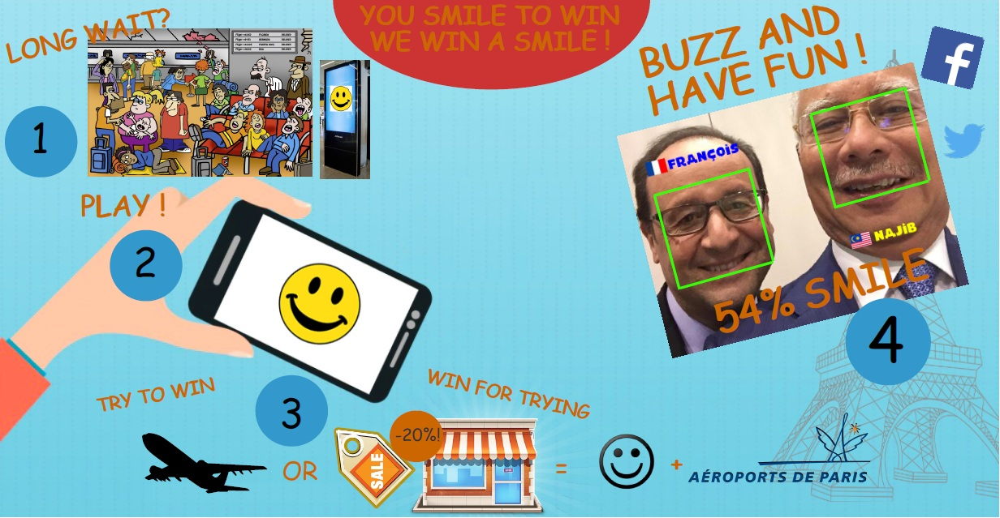
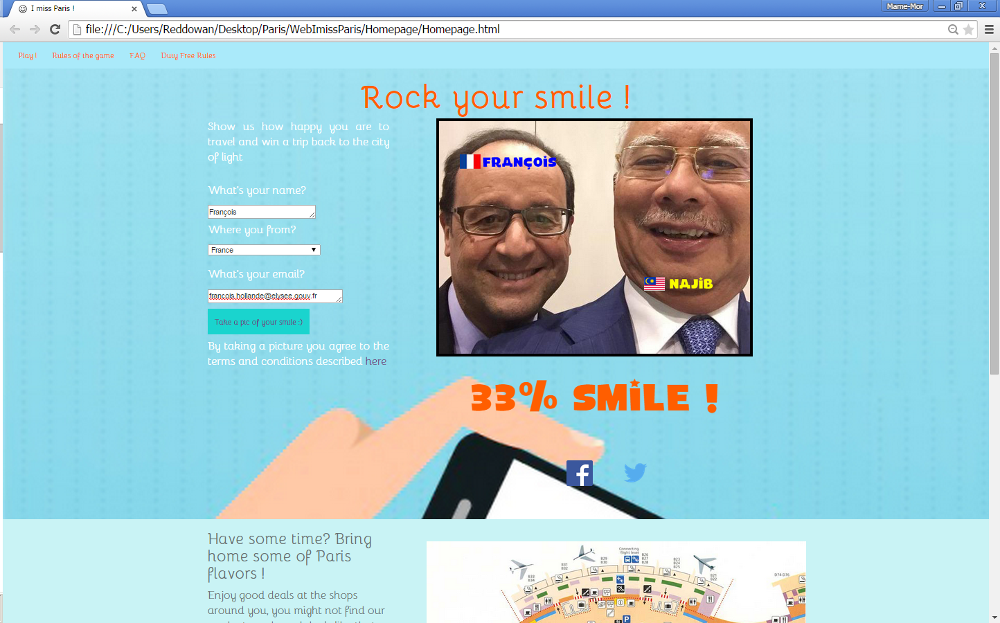

# ImissParis gaming application
A machine learning web application built for the joint Paris Airport and Amsterdam Airport Hackathon in 2015 in Paris
------------
The application starts by taking a picture of you and then measure the "size" of your smile. The bigger the smile the better the grade. Duty free shopping discounts were at stake in the concept. The algorithm used OpenCV python image library and was trained on a smiling portraits dataset.

This directory contain part of the source files (removed temporarily for maintenance).

    
    
